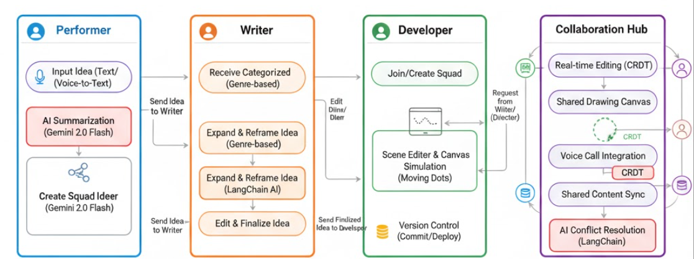

# SyncSparks

AI-powered creative collaboration platform that unites performers, writers, directors, and developers in one ecosystem.
From idea conception to simulated production, it helps creative teams collaborate in real-time with AI assistance, structured workflows, and data-driven optimization.

Empowering creators to take an idea from imagination → script → scene → simulation.

# Vision

Traditional creative workflows are often fragmented — communication lags, version conflicts, and scattered tools slow down innovation.

SyncSparks reimagines this by providing:

1) Unified dashboards for every role

2) Real-time collaborative editing (CRDT-based)

3) Secure user management via OTP + Google OAuth

4) Live Code editor with animation preview (Real Code-to-Animation)

5) AI-assisted creativity through Gemini 2.5 Flash and LangChain

Our mission is to synchronize creative sparks into a unified masterpiece.

# Data Flow Diagram 

# Core Features

# 🧑‍🎤 Performer Dashboard

Add ideas as text or voice-to-text inputs

AI summarization of rough ideas using Gemini 2.0 Flash

Create private/public squads with invite codes

Generate interactive Mind Maps:

Editable nodes (color, width, title, description)

Customizable edges

Export as PDF/PNG

Advanced search & filter (text, date range)

Send ideas directly to Writers (via Writer ID using MongoDB indexing)

Search nearby Writers in map by entering radius(in km)

# ✍️ Writer Dashboard

Receives performer ideas categorized by genre (Fantasy, Comedy, Drama, etc.)

Expand ideas using Gemini + LangChain pipelines

Edit and refine AI outputs

Forward finalized ideas to developer squads for simulation creation with search filters according to squad ID

# 💻 Developer Dashboard

Create or join private squads (invite code + password)

Accept tasks from Writers/Directors

Work inside a Scene Simulation Editor :

Edit Code to change animation

Take reference from a sample scene definition code

save work in real time so that other developer can directly continue from the code work of previous developer

# 🎬 Collaboration Hub

Real-time collaborative workspace for all roles

Shared canvas, drawing, and scene optimization

CRDT-based conflict resolution for concurrent edits

Integrated voice call for live discussions

Schema-level AI optimizations for smoother operations

## Tech Stack 

| Layer              | Technology                                        |
| ------------------ | ------------------------------------------------- |
| **Frontend**       | Next.js (TypeScript), TailwindCSS                 |
| **Backend**        | Node.js, Express.js                               |
| **Database**       | MongoDB with Indexed Collections                  |
| **Authentication** | OTP Verification, Google OAuth, HTTP-only Cookies |
| **AI Layer**       | Gemini 2.5 Flash, LangChain                       |
| **Real-Time Sync** | CRDT, WebSockets                                  |
| **Visualization**  | React Flow, D3.js PixiJS                          |

# Authentication & Security

Manual login/signup with OTP verification

Google OAuth integration

Sessions managed with HTTP-only secure cookies

Role-based access to dashboards and operations

Encrypted data and access tokens

#  AI Integrations

Gemini 2.5 Flash → Idea summarization, genre classification, creative expansion

LangChain → Schema-level query optimization, context chaining, AI-assisted prompt optimization

Voice-to-text pipeline for performers

AI cache and retrieval augmentation for fast response time

#  Optimizations

LangChain schema optimization improves database query performance

Indexed MongoDB fields for fast idea search

AI caching for repeated tasks

Frontend optimization with React Suspense and dynamic imports

CRDT-based collaboration prevents data overwrites and ensures smooth real-time editing

#  Real-World Impact

Streamlines creative collaboration for content creators, filmmakers, writers, and developers

Connects creativity and technology in one synchronized workflow

Reduces version conflicts and communication delays

Enables independent creators to build cinematic experiences collaboratively

Promotes AI-driven productivity in creative industries

## SyncSparks helps creators focus on art, not admin — turning imagination into reality faster than ever.

