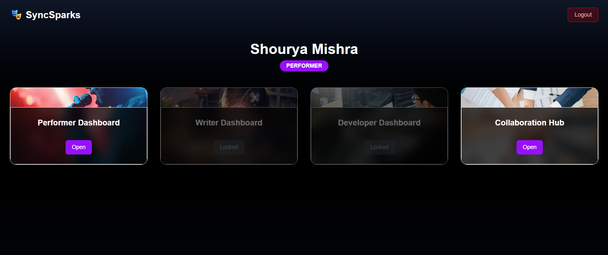
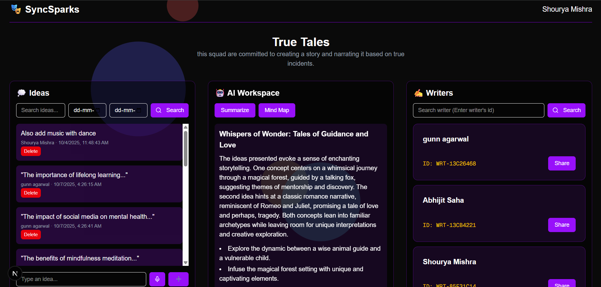
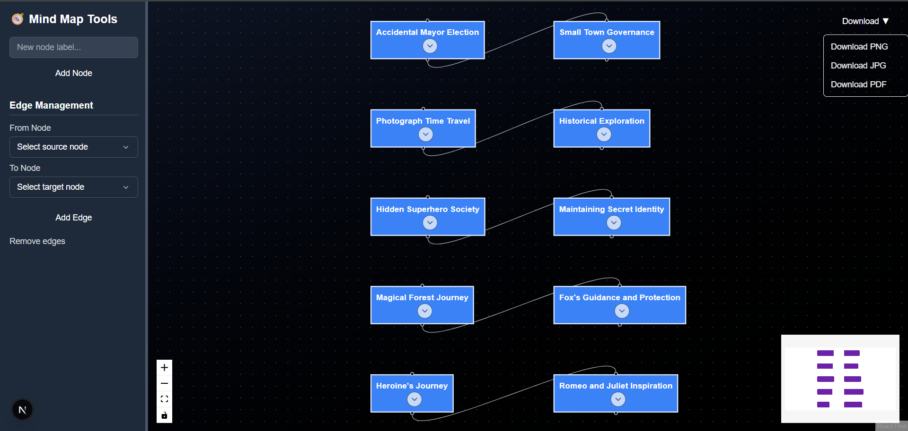
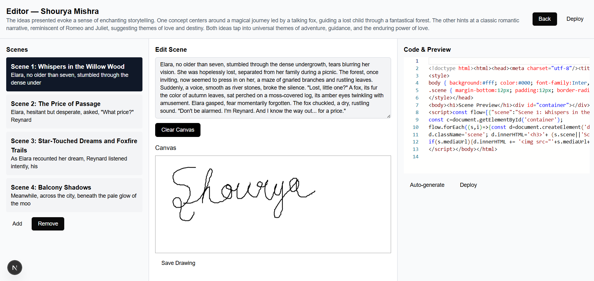

# SyncSparks

AI-powered creative collaboration platform that unites performers, writers, directors, and developers in one ecosystem.
From idea conception to simulated production, it helps creative teams collaborate in real-time with AI assistance, structured workflows, and data-driven optimization.

Empowering creators to take an idea from imagination → script → scene → simulation.

# Vision

Traditional creative workflows are often fragmented — communication lags, version conflicts, and scattered tools slow down innovation.

SyncSparks reimagines this by providing:

1) Unified dashboards for every role

2) Real-time collaborative editing (CRDT-based)

3) Secure user management via OTP + Google OAuth

4) AI-assisted creativity through Gemini 2.0 Flash and LangChain

Our mission is to synchronize creative sparks into a unified masterpiece.

